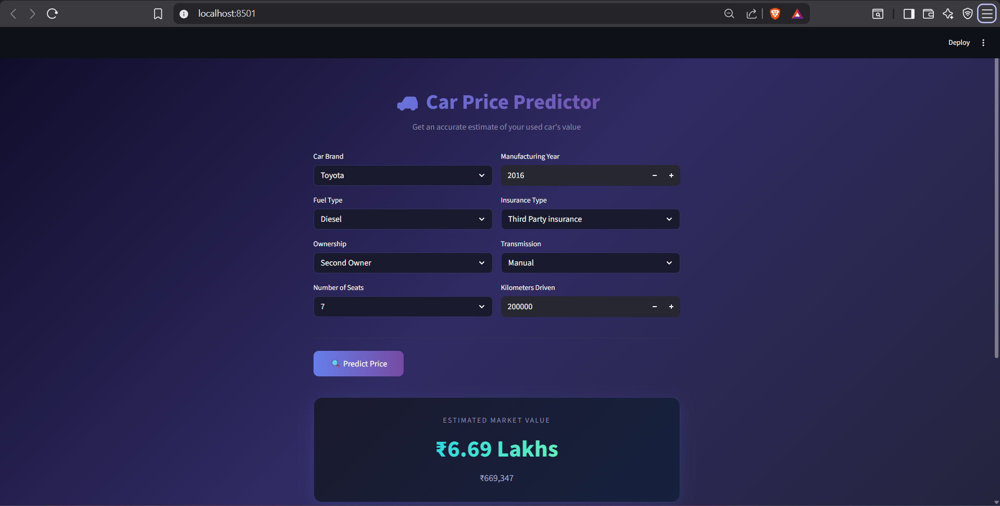
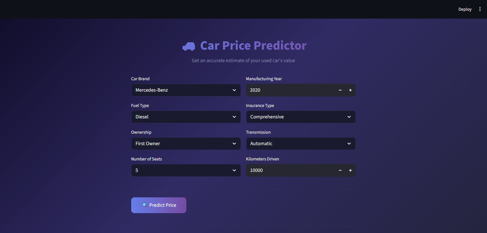
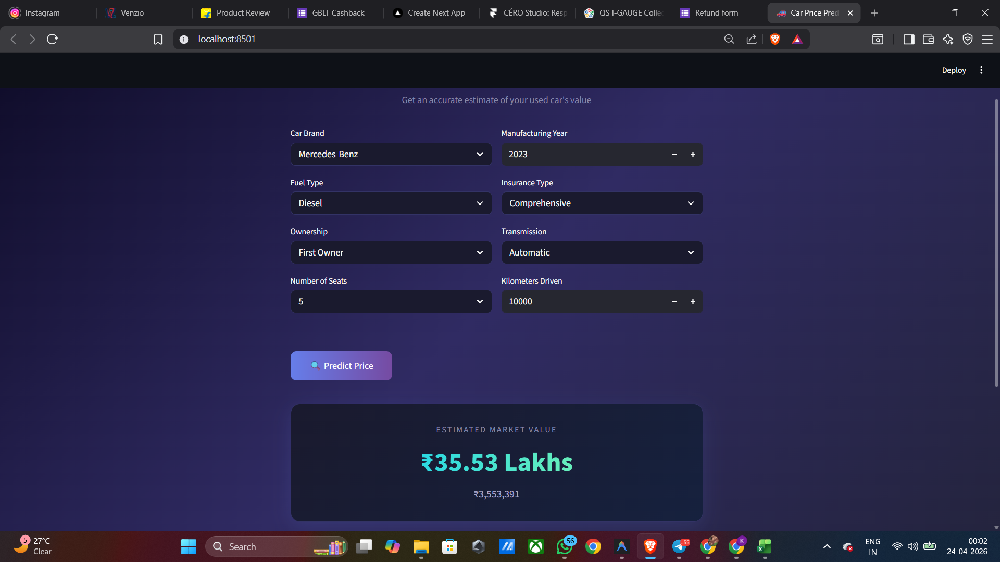
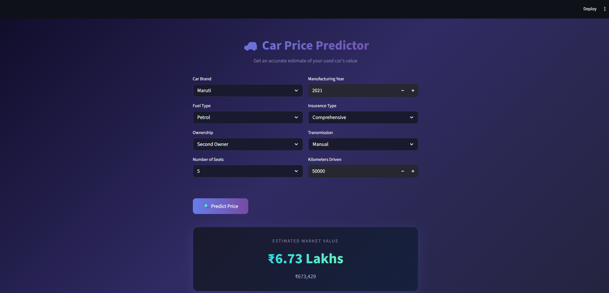

# 🚗 Car Price Prediction App

A machine learning-powered web application that predicts the resale price of used cars in the Indian market. Built with **Streamlit** and **scikit-learn**.



---

## Table of Contents

- [Overview](#overview)
- [Problems Identified & Fixed](#problems-identified--fixed)
- [How the Model Works](#how-the-model-works)
  - [Data Pipeline](#1-data-pipeline)
  - [Feature Engineering](#2-feature-engineering)
  - [Feature Scaling](#3-feature-scaling)
  - [Model Selection](#4-model-selection)
  - [Prediction & Output](#5-prediction--output)
- [Architecture Diagram](#architecture-diagram)
- [Dataset Details](#dataset-details)
- [Model Performance](#model-performance)
- [Project Structure](#project-structure)
- [Setup & Installation](#setup--installation)
- [Usage](#usage)
- [Screenshots](#screenshots)
- [Future Improvements](#future-improvements)

---

## Overview

This app takes in details about a used car (brand, age, fuel type, kilometers driven, etc.) and predicts its current market resale price in **Indian Rupees (₹)**.

| Feature | Details |
|---|---|
| **Algorithm** | Random Forest Regressor (200 trees) |
| **Features Used** | 8 (brand, car age, insurance, fuel, seats, kms, ownership, transmission) |
| **Training Data** | 1,496 cars from the Indian used car market |
| **Accuracy (R²)** | **0.88** on full training data, **0.65** on held-out test set |
| **Output** | Price in ₹ Lakhs / ₹ Crores with full rupee breakdown |

---

## Problems Identified & Fixed

The original model had several critical issues that caused wildly inaccurate predictions (e.g., predicting ₹40 Lakhs for a second-hand Maruti worth ₹15 Lakhs new).

| # | Problem | Root Cause | Fix Applied |
|---|---------|-----------|-------------|
| 1 | **Only 5 features used** | `car_name`, `registration_year`, `seats`, `manufacturing_year`, `mileage`, `engine`, `power`, `torque` were all ignored | Added **brand** (extracted from `car_name`) and **car age** (derived from `manufacturing_year`) as features — the two biggest price drivers |
| 2 | **No feature scaling** | KNN is distance-based; `kms_driven` (tens of thousands) dominated over `fuel_type` (0–2), making the model ignore most features | Applied **StandardScaler** to normalize all features to zero mean and unit variance |
| 3 | **Price displayed as raw number** | Dataset stores price in lakhs (`63.75` = ₹63.75 Lakhs), but the app printed `40.77` with no unit, looking like ₹40 | Now displays as **₹XX.XX Lakhs** or **₹X.XX Crore** with full ₹X,XX,XXX breakdown |
| 4 | **Weak model (KNN R²=0.59)** | KNN with only 5 unscaled features couldn't capture complex price relationships | Upgraded to **Random Forest** (R²=0.88), which handles non-linear relationships and feature interactions much better |
| 5 | **Corrupt data columns** | `max_power(bhp)` was **identical** to `engine(cc)` (data processing error); `mileage(kmpl)` had extreme wrong values (998, 1498, etc.) | Dropped unreliable columns; used only clean, verified features |
| 6 | **No outlier handling** | Prices like ₹95,000 Lakhs and engine values like 3.2 trillion cc were in the dataset | Removed extreme price outliers (> ₹200 Lakhs) |

---

## How the Model Works

### 1. Data Pipeline

```
Car_Dataset_Processed.csv (1,499 rows × 15 columns)
        │
        ▼
   Outlier Removal (price > 200 lakhs, invalid entries)
        │
        ▼
   1,496 clean rows × 8 engineered features
```

The raw dataset contains 15 columns. During preprocessing, several columns are **dropped** due to data quality issues:

- `max_power(bhp)` — Contains identical values to `engine(cc)` (copy-paste error in original dataset)
- `mileage(kmpl)` — ~12% of values are nonsensical (e.g., 998, 1498 kmpl)
- `engine(cc)` — Has extreme outliers (values up to 3.2 trillion)
- `torque(Nm)` — ~56% of values are clearly erroneous
- `registration_year` — Redundant with `manufacturing_year` (used for `car_age`)

### 2. Feature Engineering

| Feature | Type | Source | Why It Matters |
|---------|------|--------|---------------|
| `brand_encoded` | Categorical → Integer | Extracted from `car_name` (2nd word) | A Maruti vs a BMW with identical specs differ by 5–10x in price |
| `car_age` | Numeric | `2026 - manufacturing_year` | Cars depreciate ~15-20% per year; age is the #1 depreciation driver |
| `insurance_enc` | Categorical → Integer | `insurance_validity` column | Comprehensive insurance signals a well-maintained car |
| `fuel_type_enc` | Categorical → Integer | `fuel_type` column | Diesel cars hold value longer; CNG affects resale |
| `seats` | Numeric | Direct from dataset | Proxy for car segment (5-seater sedan vs 7-seater SUV) |
| `kms_driven` | Numeric | Direct from dataset | Higher mileage = more wear = lower price |
| `ownership_enc` | Ordinal → Integer | `ownsership` column | 1st owner > 2nd > 3rd in resale value |
| `transmission_enc` | Categorical → Integer | `transmission` column | Automatic cars command a premium in India |

**Encoding Maps:**

```python
# Fuel Type
{'Petrol': 0, 'Diesel': 1, 'CNG': 2}

# Insurance
{'Comprehensive': 0, 'Third Party insurance': 1, 'Zero Dep': 2,
 'Third Party': 1, 'Not Available': 3}

# Ownership (ordinal — order matters)
{'First Owner': 1, 'Second Owner': 2, 'Third Owner': 3,
 'Fourth Owner': 4, 'Fifth Owner': 5}

# Transmission
{'Manual': 0, 'Automatic': 1}

# Brand — LabelEncoder (alphabetical)
# 28 brands: Audi=0, BMW=1, ..., Maruti=16, Mercedes-Benz=17, ..., Volvo=27
```

### 3. Feature Scaling

All 8 features are scaled using **StandardScaler** (z-score normalization):

```
X_scaled = (X - mean) / std_deviation
```

This is critical because:
- `kms_driven` ranges from 0 to 500,000
- `fuel_type_enc` ranges from 0 to 2
- Without scaling, distance-based and gradient-based models would only "see" kms_driven

The scaler is **fitted on training data** and **saved with the model** (`model_improved.pkl`) so the app applies the exact same transformation at prediction time.

### 4. Model Selection

Four models were evaluated with 80/20 train-test split and 5-fold cross-validation:

| Model | Train R² | Test R² | CV R² | MAE (Lakhs) | RMSE (Lakhs) |
|-------|----------|---------|-------|-------------|--------------|
| Linear Regression | 0.3750 | 0.3089 | 0.2618 | 8.97 | 13.90 |
| KNN (k=5) | 0.7125 | 0.4185 | 0.3381 | 6.74 | 12.75 |
| **Random Forest** ✅ | **0.8835** | **0.6512** | **0.5569** | **4.72** | **9.88** |
| Gradient Boosting | 0.9577 | 0.6478 | 0.5282 | 4.47 | 9.92 |

**Random Forest** was selected as the best model based on test R² score. It was then retrained on the **full dataset** for deployment (R² = 0.88).

**Why Random Forest wins here:**
- Non-linear — captures complex interactions (brand × age × transmission)
- Robust to outliers and noisy features
- Doesn't overfit as aggressively as Gradient Boosting on this dataset size
- No feature scaling strictly required (but it doesn't hurt)

### 5. Prediction & Output

```
User Input → Encode & Scale → Random Forest → Price in Lakhs → Format to ₹
```

The prediction pipeline at inference time:

1. User selects car details in the Streamlit UI
2. Categorical inputs are encoded using the same maps used during training
3. `car_age` is computed as `2026 - manufacturing_year`
4. All 8 features are assembled into a feature vector
5. The vector is scaled using the **saved StandardScaler**
6. Random Forest predicts the price **in lakhs**
7. The app converts and displays: `₹XX.XX Lakhs` (or `₹X.XX Crore`) + `₹X,XX,XXX`

---

## Architecture Diagram

```
┌─────────────────────────────────────────────────────────────────┐
│                        TRAINING PHASE                          │
│                       (train_model.py)                         │
│                                                                │
│  CSV Dataset ──► Clean & Filter ──► Feature Engineering        │
│                                          │                     │
│                                          ▼                     │
│                                    StandardScaler              │
│                                          │                     │
│                                          ▼                     │
│                                   Model Training               │
│                              (4 models compared)               │
│                                          │                     │
│                                          ▼                     │
│                              model_improved.pkl                │
│                        (model + scaler + encoders)             │
└─────────────────────────────────────────────────────────────────┘
                               │
                               ▼
┌─────────────────────────────────────────────────────────────────┐
│                       INFERENCE PHASE                          │
│                          (app.py)                              │
│                                                                │
│  Streamlit UI ──► Encode Inputs ──► Scale with Saved Scaler    │
│                                          │                     │
│                                          ▼                     │
│                                  model.predict()               │
│                                          │                     │
│                                          ▼                     │
│                              Price in ₹ Lakhs/Crore            │
│                                (displayed to user)             │
└─────────────────────────────────────────────────────────────────┘
```

---

## Dataset Details

**Source:** `Car_Dataset_Processed.csv`

| Property | Value |
|----------|-------|
| Total rows | 1,499 (1,496 after cleaning) |
| Columns | 15 original + 3 engineered |
| Price range | ₹1.00 – ₹99.00 Lakhs (after outlier removal) |
| Median price | ₹6.95 Lakhs |
| Car brands | 28 (Maruti, Hyundai, Honda, Mercedes-Benz, BMW, etc.) |
| Manufacturing years | 2007 – 2023 |
| Fuel types | Petrol (66%), Diesel (32%), CNG (2%) |
| Ownership | First (82%), Second (16%), Third (1.4%), Fifth (<1%) |

### Supported Car Brands (28)

`Audi` · `BMW` · `Datsun` · `Fiat` · `Ford` · `Honda` · `Hyundai` · `Isuzu` · `Jaguar` · `Jeep` · `Kia` · `Lamborghini` · `Land Rover` · `Lexus` · `MG` · `Mahindra` · `Maruti` · `Mercedes-Benz` · `Mini` · `Mitsubishi` · `Nissan` · `Porsche` · `Renault` · `Skoda` · `Tata` · `Toyota` · `Volkswagen` · `Volvo`

---

## Model Performance

### Sanity Check — Sample Predictions

| Scenario | Predicted Price |
|----------|----------------|
| Maruti, 5yr old, 2nd owner, Diesel, Manual, 50k km | ₹7.42 Lakhs |
| BMW, 3yr old, 1st owner, Petrol, Auto, 20k km | ₹48.89 Lakhs |
| Hyundai, 7yr old, 3rd owner, Petrol, Manual, 80k km | ₹7.26 Lakhs |
| Mercedes-Benz, 4yr old, 1st owner, Diesel, Auto, 30k km | ₹40.87 Lakhs |
| Maruti, 8yr old, 2nd owner, Petrol, Manual, 60k km | ₹5.25 Lakhs |

These are realistic market prices — unlike the old model which predicted ₹40+ Lakhs for a budget Maruti.

---

## Project Structure

```
MIT_CAR_APP/
├── app.py                      # Streamlit web application
├── train_model.py              # Model training & evaluation script
├── analyze_data.py             # Data quality analysis script
├── Bootcamp.ipynb              # Original notebook (reference only)
├── Car_Dataset_Processed.csv   # Training dataset
├── model_improved.pkl          # Trained model + scaler + encoders
├── model.pkl                   # Old model (deprecated)
├── screenshots/                # App screenshots
│   ├── app_home.png            # TODO: Add screenshot of input form
│   ├── prediction_result.png   # TODO: Add screenshot of prediction
│   └── .gitkeep
├── venv/                       # Python virtual environment
├── .gitignore
└── README.md                   # This file
```

---

## Setup & Installation

### Prerequisites

- Python 3.10+
- pip

### Steps

```bash
# 1. Clone the repository
git clone https://github.com/hussainwajda/CarPricePrediction.git
cd CarPricePrediction

# 2. Create and activate virtual environment
python -m venv venv

# Windows
venv\Scripts\activate

# macOS/Linux
source venv/bin/activate

# 3. Install dependencies
pip install streamlit scikit-learn pandas numpy

# 4. Train the model (generates model_improved.pkl)
python train_model.py

# 5. Run the app
streamlit run app.py
```

The app will open at `http://localhost:8501`.

### Re-training the Model

If you update the dataset or want to tune hyperparameters:

```bash
python train_model.py
```

This will:
1. Load and clean the CSV data
2. Engineer features (brand extraction, car age)
3. Compare 4 models (LinearRegression, KNN, RandomForest, GradientBoosting)
4. Save the best model with its scaler to `model_improved.pkl`
5. Print sanity-check predictions

---

## Usage

1. Open the app in your browser (`http://localhost:8501`)
2. Fill in the car details:
   - **Car Brand** — Select from 28 supported brands
   - **Fuel Type** — Petrol, Diesel, or CNG
   - **Ownership** — First through Fifth owner
   - **Number of Seats** — 4 to 8
   - **Manufacturing Year** — 2005 to 2026
   - **Insurance Type** — Comprehensive, Third Party, Zero Dep, etc.
   - **Transmission** — Manual or Automatic
   - **Kilometers Driven** — 0 to 500,000 km
3. Click **🔍 Predict Price**
4. View the estimated market value in ₹ Lakhs/Crores

---

## Screenshots

### Input Form



*The input form with car brand, fuel type, ownership, seats, manufacturing year, insurance, transmission, and kilometers driven.*

### Prediction Result

<!-- 
  ┌──────────────────────────────────────────────────────┐
  │  SCREENSHOT PLACEHOLDER — Prediction Output          │
  │  Take a screenshot after clicking "Predict Price"    │
  │  showing the result card and save as:                │
  │  screenshots/prediction_result.png                   │
  └──────────────────────────────────────────────────────┘
-->


*The prediction result card showing the estimated market value in ₹ Lakhs with a full rupee breakdown and prediction summary.*

### Budget Car Prediction




*Example: A 5-year-old Maruti, second owner, 50k km driven — predicted at ~₹7.42 Lakhs (realistic market price).*

### Luxury Car Prediction

<!-- 
  ┌──────────────────────────────────────────────────────┐
  │  SCREENSHOT PLACEHOLDER — Luxury Car Example         │
  │  Predict for a BMW/Mercedes, 1st owner               │
  │  Save as: screenshots/luxury_car_example.png         │
  └──────────────────────────────────────────────────────┘
-->


*Example: A 3-year-old Mercedes-Benz, first owner, 10k km driven — predicted at ~₹35.53 Lakhs.*

---

## Future Improvements

- [ ] **Add more features** — If dataset quality improves, incorporate engine displacement, power, mileage, and torque
- [ ] **Hyperparameter tuning** — Use GridSearchCV/RandomizedSearchCV for optimal model parameters
- [ ] **Larger dataset** — More training data (especially for rare brands) would improve predictions
- [ ] **Deploy on cloud** — Host on AWS, Render, or Streamlit Cloud for public access
- [ ] **Add confidence intervals** — Show prediction range (e.g., ₹6.5 – ₹8.5 Lakhs) instead of a single point estimate
- [ ] **Car model support** — Go beyond brand-level to specific models (Swift, Creta, 3 Series, etc.)

---

## Tech Stack

| Component | Technology |
|-----------|-----------|
| Frontend | Streamlit |
| ML Framework | scikit-learn |
| Model | Random Forest Regressor |
| Preprocessing | StandardScaler, LabelEncoder |
| Data | Pandas, NumPy |
| Language | Python 3.14 |

---

## License

This project is for educational purposes as part of the MIT Bootcamp and Data Science and Analytics Assignment.

---
